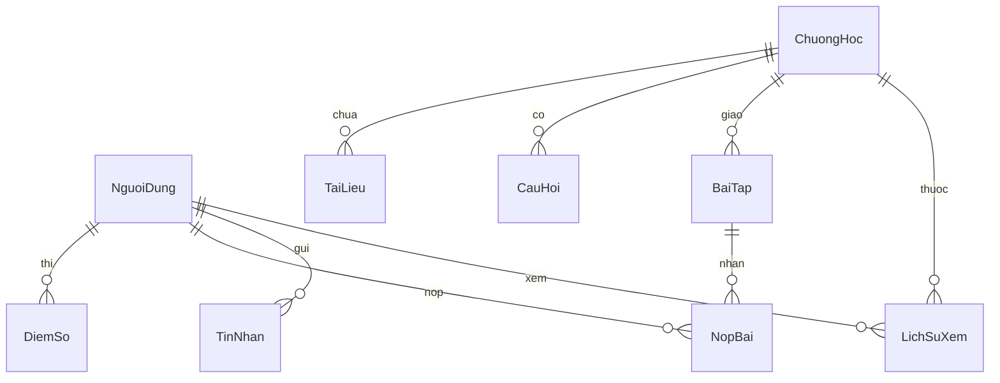
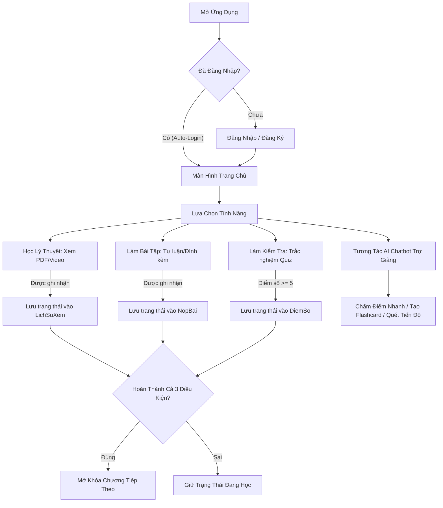

# 📚 Ứng Dụng Quản Lý Học Tập Tích Hợp AI Trợ Giảng (QuanLyHocTap)

Ứng dụng Android native được phát triển bằng ngôn ngữ **Java** nhằm hỗ trợ sinh viên học tập hiệu quả môn **Lập trình di động Android / Kiến trúc máy tính**. Ứng dụng tích hợp mô hình ngôn ngữ lớn (AI Chatbot) đóng vai trò là Trợ giảng 24/7 để chấm bài, tạo thẻ ghi nhớ và thống kê tiến độ học tập.

---

## 🌟 Các Tính Năng Cốt Lõi

### 1. Phân Hệ Sinh Viên
*   **Học tập đa phương tiện**: Xem danh sách chương học, mở đọc tài liệu học tập định dạng **PDF** (sử dụng thư viện PDF Viewer local) và xem **Video bài giảng** trực tuyến/ngoại tuyến.
*   **Kiểm tra trắc nghiệm (Quiz)**: Làm bài thi trắc nghiệm tính giờ cho từng chương, hệ thống tự động chấm điểm và lưu lịch sử.
*   **Nộp bài tập tự luận (Assignment)**: Đọc đề bài của giảng viên, trực tiếp nhập câu trả lời dạng văn bản hoặc đính kèm các định dạng file bài làm của mình.
*   **Quét tiến độ học tập (Study Scan)**: Giao diện trực quan thống kê tiến độ học tập cá nhân từng chương bao gồm: số chương hoàn thành (`DONE`), đang học (`PARTIAL`), và chưa bắt đầu (`TODO`).
*   **Hồ sơ cá nhân & Giao diện tối (Dark Mode)**: Chỉnh sửa thông tin họ tên, đổi ảnh đại diện (avatar) lưu trữ cục bộ, bật/tắt chế độ tối (Dark Mode) đồng bộ hệ thống.
*   **Nhóm Chat Lớp học**: Chat trực tiếp với giảng viên và các bạn học khác cùng lớp học phần theo thời gian thực để trao đổi bài tập.

### 2. Phân Hệ Giảng Viên
*   Quản lý lớp học phần, danh sách sinh viên.
*   Theo dõi tiến độ học tập chi tiết của từng sinh viên trong lớp phụ trách.
*   Chấm điểm và gửi nhận xét trực tiếp cho bài tập tự luận mà sinh viên đã nộp.

### 3. Trợ Lý Học Tập AI Chatbot (Đặc Sắc)
*   **Streaming Token**: Phản hồi của AI hiển thị thời gian thực theo từng chữ (SSE) đi kèm nút **Stop** để dừng phản hồi của AI bất cứ lúc nào.
*   **Xóa cuộc trò chuyện**: Nút **Reset Chat** (Thùng rác) tiện lợi trên Header Bar giúp nhanh chóng dọn dẹp lịch sử hội thoại để bắt đầu phiên mới.
*   **Quét tiến độ bằng AI**: AI đọc trực tiếp cơ sở dữ liệu SQLite của user hiện tại, thống kê chi tiết phần trăm hoàn thành, trạng thái Quiz, Bài tập, PDF, Video và đưa ra báo cáo kết quả cùng lời khuyên học tập cá nhân hóa trực tiếp trong chat.
*   **Tạo Flashcard thông minh**: Sinh viên chọn chương học, AI sẽ tự động biên soạn và tạo ra 5 thẻ ghi nhớ (Flashcard) học tập. Thẻ có hiệu ứng lật 3D xoay chiều mượt mà để hỗ trợ học thuật ngữ.
*   **AI chấm thử bài tập**: AI đọc trực tiếp đề bài và bài làm đã nộp (dạng văn bản hoặc nhận diện file đính kèm) từ SQLite của sinh viên để đưa ra nhận xét chi tiết (Điểm tốt, Điểm cần cải thiện, Gợi ý bổ sung và Điểm số đề xuất thang 10) ngay lập tức.
Trả lời real time theo câu hỏi của người dùng
---

## 🛠️ Công Nghệ Sử Dụng

*   **Core**: Java 17, Android SDK.
*   **Kiến trúc**: MVC / MVVM (sử dụng `ViewModel`, `LiveData` kết hợp với `Handler(Looper.getMainLooper())` để cập nhật UI luồng chính an toàn, tránh lỗi luồng).
*   **Cơ sở dữ liệu**: **SQLite** (sử dụng `SQLiteOpenHelper` quản lý và truy vấn dữ liệu cục bộ).
*   **Mạng & API**: **OkHttp3** (sử dụng để gọi API streaming bất đồng bộ kết hợp Server-Sent Events - SSE).
*   **AI Engine**: Mô hình **Gemini 2.0 Flash / GPT** tích hợp thông qua cổng kết nối bảo mật **OpenRouter API**.
*   **Thư viện bên thứ ba**:
    *   `com.github.barteksc:android-pdf-viewer` hỗ trợ hiển thị PDF mượt mà.
    *   `Google Material Components` cho giao diện tối giản, hiện đại và chuẩn Material Design.

---

## 💾 Cấu Trúc Lưu Trữ Dữ Liệu (SQLite Database Schema)

Cơ sở dữ liệu cục bộ của ứng dụng được đặt tên là `KienTrucMayTinh.db` bao gồm các bảng được thiết kế liên kết chặt chẽ theo mã số ID của người dùng đăng nhập hiện tại:

### Chi tiết các bảng chính:

1.  **NguoiDung (TABLE_USER)**:
    *   `MaNguoiDung` (INTEGER, Primary Key, AutoIncrement): ID duy nhất của tài khoản.
    *   `TenDangNhap` (TEXT): Tên đăng nhập.
    *   `MatKhau` (TEXT): Mật khẩu đăng nhập.
    *   `HoTen` (TEXT): Họ và tên đầy đủ.
    *   `QuyenHan` (INTEGER): Phân quyền (`1` = Sinh viên, `2` = Giảng viên).
    *   `MaLop` (TEXT): Lớp học phần phụ trách hoặc đang học.

2.  **ChuongHoc (TABLE_CHAPTER)**:
    *   `MaChuong` (INTEGER, Primary Key): ID chương học.
    *   `TenChuong` (TEXT): Tên chương.
    *   `MoTa` (TEXT): Nội dung tóm tắt của chương.
    *   `ThuTuBaiHoc` (INTEGER): Số thứ tự sắp xếp bài học.

3.  **TaiLieu (TABLE_DOCUMENT)**:
    *   `MaTaiLieu` (INTEGER, Primary Key, AutoIncrement): ID tài liệu.
    *   `MaChuong` (INTEGER): Thuộc chương học nào.
    *   `Loai` (TEXT): Định dạng tài liệu (`PDF` hoặc `Video`).
    *   `TenFile` (TEXT): Tên file tài liệu lưu trữ trong thư mục assets hoặc bộ nhớ local.

4.  **CauHoi (TABLE_QUESTION)**:
    *   `MaCH` (INTEGER, Primary Key, AutoIncrement): ID câu hỏi trắc nghiệm.
    *   `MaChuong` (INTEGER): Thuộc chương học nào.
    *   `NoiDung` (TEXT): Câu hỏi trắc nghiệm.
    *   `DapAnA`, `DapAnB`, `DapAnC`, `DapAnD` (TEXT): Các phương án chọn.
    *   `DapAnDung` (TEXT): Đáp án chính xác (`A`, `B`, `C`, `D`).

5.  **DiemSo (TABLE_SCORE)**:
    *   `ID` (INTEGER, Primary Key, AutoIncrement): ID dòng điểm số.
    *   `MaNguoiDung` (INTEGER): ID sinh viên làm bài.
    *   `MaChuong` (INTEGER): Chương học thực hiện thi Quiz.
    *   `Diem` (INTEGER): Số câu trả lời đúng của sinh viên.

6.  **BaiTap (TABLE_ASSIGNMENT)**:
    *   `MaBT` (INTEGER, Primary Key, AutoIncrement): ID đề bài tập tự luận.
    *   `MaChuong` (INTEGER): Thuộc chương học nào.
    *   `DeBai` (TEXT): Câu hỏi đề bài tập tự luận.

7.  **NopBai (TABLE_SUBMISSION)**:
    *   `MaNop` (INTEGER, Primary Key, AutoIncrement): ID bản ghi nộp bài.
    *   `MaNguoiDung` (INTEGER): ID sinh viên nộp bài.
    *   `MaBT` (INTEGER): ID bài tập tự luận tương ứng.
    *   `TraLoiVanBan` (TEXT): Câu trả lời bằng văn bản của sinh viên.
    *   `DuongDanFile` (TEXT): Đường dẫn file đính kèm bài làm (nếu có).
    *   `DiemGV` (REAL): Điểm số do giảng viên chấm (mặc định `-1` nếu chưa chấm).
    *   `NhanXetGV` (TEXT): Lời phê, nhận xét của giảng viên.

8.  **LichSuXem (TABLE_LICH_SU_XEM)**:
    *   `MaNguoiDung` (INTEGER): ID sinh viên.
    *   `MaChuong` (INTEGER): ID chương học.
    *   `LoaiTaiLieu` (TEXT): Định dạng tài liệu (`PDF` hoặc `Video`).
    *   `TrangThai` (INTEGER): Trạng thái xem (`0` = Chưa học, `1` = Đã xem/học xong).

---

## 🔄 Luồng Hoạt Động Của Hệ Thống

1.  **Đăng nhập & Phiên làm việc (Session)**:
    *   Ứng dụng sử dụng `SharedPreferences` lưu trữ `KEY_USER_ID` và `KEY_USER_ROLE`.
    *   Hệ thống tự động thực hiện **Auto-login** nếu phiên đăng nhập trước đó vẫn tồn tại. Khi người dùng thực hiện đăng xuất (Logout) ở mục Hồ sơ, toàn bộ session sẽ được làm sạch an toàn và điều hướng quay lại `LoginActivity`.
2.  **Khóa & Mở khóa chương học (Chapter Unlocking Logic)**:
    *   Mặc định Chương 1 luôn mở cho học viên.
    *   Để mở khóa chương học tiếp theo, sinh viên bắt buộc phải hoàn thành **đồng thời** các điều kiện của chương học trước đó:
        1.  Xem đầy đủ tài liệu học tập bao gồm **file PDF** và **Video bài giảng**.
        2.  Làm bài **kiểm tra trắc nghiệm (Quiz)** và đạt điểm số tối thiểu **từ 5.0 trở lên** (làm đúng >= 50% câu hỏi).
        3.  Đã hoàn thành việc **nộp bài tập tự luận (Assignment)** (bằng văn bản hoặc file đính kèm).
3.  **Tương tác AI Chatbot**:
    *   Chatbot được tối ưu hóa System Prompt để đóng vai là chuyên gia hỗ trợ lập trình Android.
    *   Khi người dùng bấm chọn các nút tính năng nhanh (như Quét tiến độ, AI chấm bài tập), chatbot tự động kết nối SQLite, lấy thông tin cá nhân hóa của đúng user đăng nhập để truy vấn dữ liệu thô, đóng gói và gửi lên mô hình ngôn ngữ lớn để trả về kết quả chấm điểm hoặc bảng phân tích học tập thời gian thực trong khung chat.
