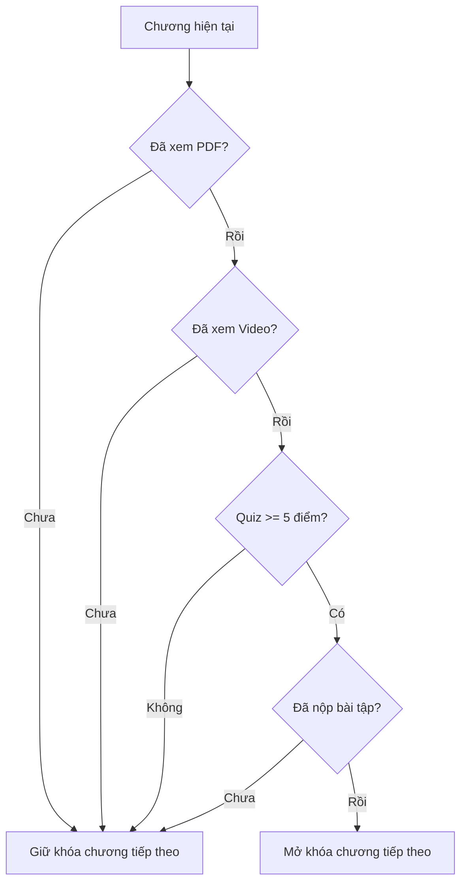
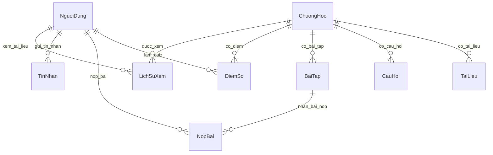
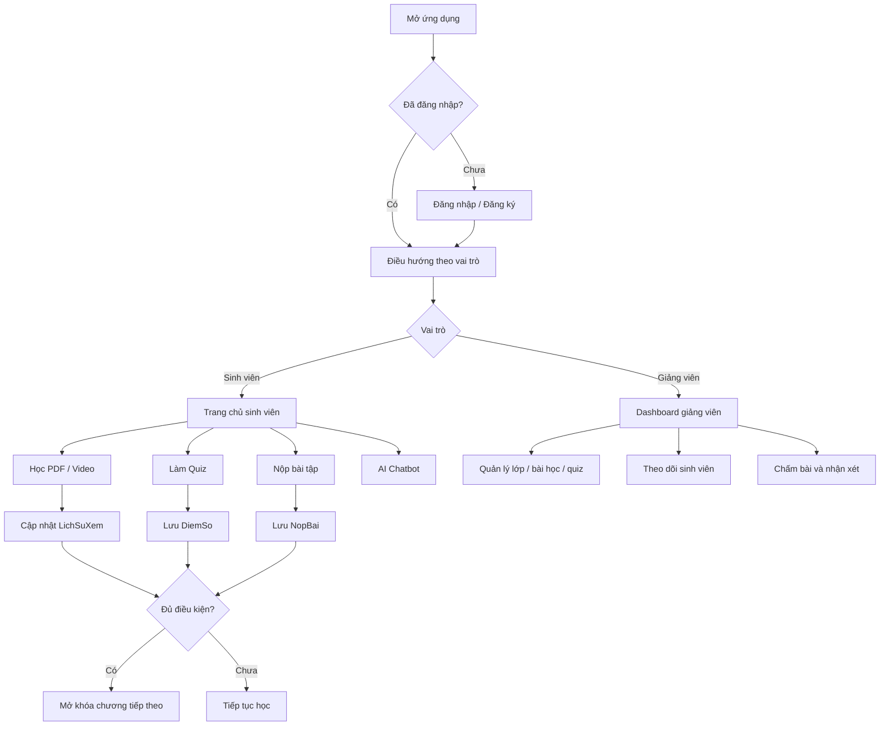
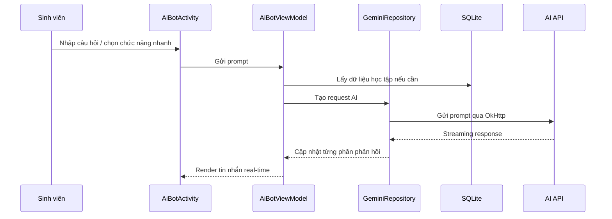

<div align="center">

# 📚 AndroidLearn - Ứng Dụng Quản Lý Học Tập Tích Hợp AI

**Ứng dụng Android Native hỗ trợ học tập, quản lý lớp học, kiểm tra trắc nghiệm, nộp bài tập, thống kê tiến độ và trợ giảng AI thông minh.**


</div>

---

## 📌 Giới thiệu dự án

**AndroidLearn** là ứng dụng quản lý học tập được xây dựng bằng **Java Native Android**, hướng đến mô hình học tập số dành cho sinh viên và giảng viên. Ứng dụng tập trung vào việc hỗ trợ sinh viên học theo từng chương, theo dõi tiến độ cá nhân, làm quiz, nộp bài tập tự luận và tương tác với trợ giảng AI.

Dự án sử dụng **SQLite local database** để lưu trữ dữ liệu người dùng, chương học, tài liệu, quiz, bài tập, điểm số, lịch sử học tập và tin nhắn. Ngoài ra, ứng dụng tích hợp AI thông qua API để hỗ trợ các tác vụ như trả lời câu hỏi, quét tiến độ, tạo flashcard và chấm thử bài tập.

---

## ✨ Điểm nổi bật

- 🎓 Phân hệ riêng cho **Sinh viên** và **Giảng viên**.
- 📖 Học theo chương với tài liệu **PDF** và **Video**.
- 🧠 Quiz trắc nghiệm có lưu điểm và đánh giá năng lực.
- 📝 Nộp bài tập tự luận kèm file PDF/Word.
- 👨‍🏫 Giảng viên chấm điểm, nhận xét và theo dõi tiến độ sinh viên.
- 🤖 AI Chatbot hỗ trợ học tập theo thời gian thực.
- 🔁 Cơ chế mở khóa chương học theo điều kiện hoàn thành.
- 📊 Thống kê tiến độ, spider chart phân tích năng lực.
- 💬 Chat giữa sinh viên và giảng viên/lớp học.
- 💾 Lưu dữ liệu cục bộ bằng SQLite, không phụ thuộc backend riêng.

---

## 🧩 Chức năng chính

### 👨‍🎓 1. Phân hệ Sinh viên

| Nhóm chức năng | Mô tả |
|---|---|
| **Đăng nhập / Đăng ký** | Sinh viên tạo tài khoản, đăng nhập và lưu phiên bằng `SharedPreferences`. |
| **Trang chủ học tập** | Hiển thị các chức năng học tập chính, tiến độ hiện tại và điều hướng nhanh. |
| **Danh sách chương học** | Xem các chương học, trạng thái mở/khóa và truy cập nội dung bài học. |
| **Học tài liệu PDF** | Mở file PDF từ assets hoặc bộ nhớ nội bộ ứng dụng. |
| **Xem video bài giảng** | Phát video bài học theo từng chương. |
| **Làm quiz trắc nghiệm** | Làm bài kiểm tra theo chương, tự động chấm điểm và lưu kết quả. |
| **Nộp bài tập tự luận** | Nhập câu trả lời văn bản hoặc đính kèm file PDF/Word. |
| **Theo dõi tiến độ học tập** | Xem chương đã hoàn thành, đang học và chưa học. |
| **Phân tích năng lực** | Hiển thị biểu đồ spider chart và danh sách đánh giá theo mảng kiến thức. |
| **AI Chatbot** | Hỏi đáp, quét tiến độ, tạo flashcard, chấm thử bài tập. |
| **Flashcard AI** | Tạo và học flashcard với hiệu ứng lật thẻ. |
| **Chat học tập** | Trao đổi với giảng viên hoặc lớp học. |
| **Hồ sơ cá nhân** | Cập nhật thông tin, ảnh đại diện và đăng xuất. |

---

### 👨‍🏫 2. Phân hệ Giảng viên

| Nhóm chức năng | Mô tả |
|---|---|
| **Dashboard giảng viên** | Xem tổng quan số chương, số lớp phụ trách và truy cập nhanh các chức năng. |
| **Quản lý lớp học** | Xem danh sách lớp, số lượng sinh viên và chi tiết từng lớp. |
| **Danh sách sinh viên** | Theo dõi sinh viên trong lớp, điểm quiz và trạng thái học tập. |
| **Chi tiết sinh viên** | Xem tiến độ từng chương, điểm quiz và mở màn hình chấm bài. |
| **Chấm bài tập** | Xem câu trả lời, mở file đính kèm, nhập điểm và nhận xét. |
| **Quản lý bài học** | Thêm/sửa chương học, tài liệu PDF và video bài giảng. |
| **Quản lý quiz** | Thêm, sửa, xóa câu hỏi trắc nghiệm theo từng chương. |
| **Thống kê học tập** | Xem tỷ lệ hoàn thành, phổ điểm và cảnh báo học tập. |
| **Chat với sinh viên** | Trao đổi và nhận thông báo tin nhắn chưa đọc. |
| **Hồ sơ** | Điều hướng đến trang hồ sơ và quản lý phiên đăng nhập. |

---

### 🤖 3. Trợ giảng AI

Ứng dụng tích hợp AI Chatbot nhằm hỗ trợ sinh viên học tập chủ động hơn.

Các chức năng AI nổi bật:

- **Hỏi đáp học tập**: sinh viên có thể hỏi các nội dung liên quan đến bài học.
- **Streaming response**: phản hồi AI hiển thị theo thời gian thực.
- **Stop generating**: cho phép dừng phản hồi khi AI đang trả lời.
- **Reset chat**: xóa lịch sử hội thoại và bắt đầu phiên mới.
- **AI quét tiến độ**: đọc dữ liệu học tập trong SQLite và đưa ra nhận xét cá nhân hóa.
- **AI tạo flashcard**: sinh flashcard theo chương học để ôn tập nhanh.
- **AI chấm thử bài tập**: phân tích bài làm, đưa ra nhận xét và điểm đề xuất.

---

## 🔐 Cơ chế mở khóa chương học

Ứng dụng sử dụng cơ chế học theo tiến trình. Chương 1 được mở mặc định, các chương sau chỉ được mở khi sinh viên hoàn thành chương trước đó.

Điều kiện để mở khóa chương tiếp theo:

1. Đã xem đầy đủ tài liệu PDF nếu chương có PDF.
2. Đã xem video bài giảng nếu chương có video.
3. Đã làm quiz và đạt tối thiểu **5/10**.
4. Đã nộp bài tập nếu chương có bài tập.



---

## 🏗️ Kiến trúc tổng quan

Dự án được tổ chức theo hướng tách lớp rõ ràng giữa giao diện, xử lý dữ liệu, model và adapter.

```text
ChuongTrinh_QuanLyHocTap/
├── app/
│   ├── build.gradle.kts
│   └── src/main/
│       ├── AndroidManifest.xml
│       ├── assets/
│       │   ├── Chuong1.pdf
│       │   ├── Chuong2.pdf
│       │   ├── Chuong3.pdf
│       │   └── questions.txt
│       ├── java/com/example/androidlearn/
│       │   ├── adapter/
│       │   ├── data/
│       │   ├── model/
│       │   ├── ui/
│       │   │   ├── aibot/
│       │   │   ├── assignment/
│       │   │   ├── auth/
│       │   │   ├── chat/
│       │   │   ├── course/
│       │   │   ├── flashcard/
│       │   │   ├── main/
│       │   │   ├── profile/
│       │   │   ├── quiz/
│       │   │   ├── study/
│       │   │   └── teacher/
│       │   └── utils/
│       └── res/
│           ├── drawable/
│           ├── layout/
│           ├── menu/
│           ├── raw/
│           ├── values/
│           └── xml/
├── build.gradle.kts
├── gradle.properties
├── settings.gradle.kts
└── README.md
```

---

## 📂 Chi tiết cấu trúc mã nguồn

### `adapter/`

Chứa các `RecyclerView.Adapter` dùng để hiển thị danh sách dữ liệu trên giao diện.

| File | Vai trò |
|---|---|
| `CourseAdapter.java` | Hiển thị danh sách chương học cho sinh viên. |
| `QuizAdapter.java` | Hiển thị danh sách chương trong màn hình quiz. |
| `AssignmentAdapter.java` | Hiển thị danh sách bài tập theo chương. |
| `ChapterAdapter.java` | Adapter cho danh sách chương/bài học. |
| `TeacherClassAdapter.java` | Hiển thị danh sách lớp của giảng viên. |
| `TeacherChatAdapter.java` | Hiển thị danh sách phòng chat phía giảng viên. |
| `StudentChapterScoreAdapter.java` | Hiển thị điểm và tiến độ từng chương của sinh viên. |
| `MessageAdapter.java`, `ChatAdapter.java` | Hiển thị tin nhắn trong màn hình chat. |

---

### `data/`

Chứa lớp thao tác dữ liệu, session, mock data và tích hợp AI.

| File | Vai trò |
|---|---|
| `DatabaseHelper.java` | Lớp trung tâm quản lý SQLite: tạo bảng, seed dữ liệu, truy vấn, lưu điểm, bài nộp, chat, tiến độ. |
| `SessionManager.java` | Quản lý phiên đăng nhập người dùng. |
| `GeminiRepository.java` | Kết nối AI API, gửi prompt và nhận phản hồi. |
| `ChatHistoryManager.java` | Lưu và đọc lịch sử chat AI. |
| `FlashCardStorage.java` | Lưu trữ flashcard được AI tạo. |
| `MockData.java` | Dữ liệu mẫu phục vụ khởi tạo/testing. |

---

### `model/`

Chứa các lớp đại diện dữ liệu.

| Model | Ý nghĩa |
|---|---|
| `User.java` | Người dùng: sinh viên hoặc giảng viên. |
| `Chapter.java` | Chương học. |
| `Material.java` | Tài liệu học tập. |
| `Question.java` | Câu hỏi trắc nghiệm. |
| `Answer.java` | Đáp án/câu trả lời. |
| `QuizResult.java` | Kết quả quiz. |
| `Assignment.java` | Bài tập tự luận. |
| `Submission.java` | Bài nộp của sinh viên. |
| `Message.java` | Tin nhắn chat thường. |
| `AiMessage.java` | Tin nhắn trong AI Chatbot. |
| `FlashCard.java` | Thẻ ghi nhớ AI tạo. |

---

### `ui/`

Chứa các màn hình chính của ứng dụng, chia theo module nghiệp vụ.

| Thư mục | Chức năng |
|---|---|
| `ui/auth/` | Đăng nhập, đăng ký. |
| `ui/main/` | Trang chính sinh viên, home, phân tích năng lực. |
| `ui/course/` | Danh sách bài học, chi tiết bài học, PDF/video. |
| `ui/quiz/` | Danh sách quiz, màn hình làm câu hỏi. |
| `ui/assignment/` | Danh sách bài tập, nộp bài tự luận/file. |
| `ui/study/` | Quét và thống kê tiến độ học tập. |
| `ui/aibot/` | Chatbot AI, adapter và ViewModel. |
| `ui/flashcard/` | Học flashcard do AI tạo. |
| `ui/chat/` | Chat lớp học/sinh viên. |
| `ui/profile/` | Hồ sơ cá nhân, cập nhật avatar, đăng xuất. |
| `ui/teacher/` | Toàn bộ màn hình dành cho giảng viên. |

---

### `utils/`

Chứa các tiện ích dùng chung.

| File | Vai trò |
|---|---|
| `SimpleChartView.java` | Custom View vẽ bar chart/spider chart phân tích năng lực. |
| `DateTimeUtils.java` | Xử lý định dạng thời gian. |
| `UIUtils.java` | Tiện ích giao diện. |
| `Constants.java` | Hằng số dùng chung trong ứng dụng. |

---

## 💾 Cơ sở dữ liệu SQLite

Database chính được quản lý trong `DatabaseHelper.java`. Dữ liệu lưu cục bộ trong app, phù hợp với mô hình demo/học phần hoặc prototype không cần backend riêng.

### Các bảng chính

| Bảng | Mục đích |
|---|---|
| `NguoiDung` | Lưu tài khoản, họ tên, quyền hạn và lớp học. |
| `ChuongHoc` | Lưu thông tin chương học. |
| `TaiLieu` | Lưu tài liệu PDF/video theo chương. |
| `CauHoi` | Lưu câu hỏi trắc nghiệm. |
| `DiemSo` | Lưu điểm quiz của sinh viên. |
| `BaiTap` | Lưu đề bài tập tự luận. |
| `NopBai` | Lưu bài nộp, file đính kèm, điểm và nhận xét giảng viên. |
| `LichSuXem` | Lưu trạng thái đã xem PDF/video. |
| `TinNhan` | Lưu tin nhắn chat giữa người dùng. |

### Sơ đồ quan hệ dữ liệu



---

## 🔄 Luồng hoạt động hệ thống



---

## 🛠️ Công nghệ sử dụng

| Nhóm | Công nghệ |
|---|---|
| Ngôn ngữ | Java 17 |
| Nền tảng | Android Native |
| Build tool | Gradle Kotlin DSL |
| Database | SQLite, SQLiteOpenHelper |
| UI | XML Layout, Material Components, CardView, RecyclerView |
| Kiến trúc | MVC kết hợp MVVM ở module AI (`ViewModel`, `LiveData`) |
| Networking | OkHttp3 |
| AI API | OpenRouter/Gemini-compatible API |
| JSON | org.json |
| PDF Viewer | `io.github.afreakyelf:Pdf-Viewer` |
| Media | Android VideoView/Media APIs |
| File sharing | Android FileProvider |

---

## 📦 Dependencies chính

Một số thư viện quan trọng trong `app/build.gradle.kts`:

```kotlin
implementation(libs.appcompat)
implementation(libs.material)
implementation(libs.activity)
implementation(libs.constraintlayout)
implementation("io.github.afreakyelf:Pdf-Viewer:2.1.1")
implementation("com.squareup.okhttp3:okhttp:4.12.0")
implementation("org.json:json:20231013")
implementation("androidx.lifecycle:lifecycle-viewmodel:2.8.7")
implementation("androidx.lifecycle:lifecycle-livedata:2.8.7")
```

---

## 🚀 Cài đặt và chạy dự án

### Yêu cầu môi trường

- Android Studio Iguana/Jellyfish hoặc mới hơn.
- JDK 17.
- Android SDK:
  - `compileSdk`: 35
  - `minSdk`: 24
  - `targetSdk`: 34
- Thiết bị thật hoặc Android Emulator.

### Các bước chạy

1. Clone repository:

```bash
git clone <repository-url>
```

2. Mở project bằng Android Studio.

3. Sync Gradle.

4. Chạy ứng dụng bằng nút **Run** hoặc dùng terminal:

```bash
./gradlew :app:assembleDebug
```

Trên Windows:

```bash
gradlew.bat :app:assembleDebug
```

5. Cài APK debug từ:

```text
app/build/outputs/apk/debug/app-debug.apk
```

---

## 🔑 Cấu hình AI API

Module AI sử dụng `GeminiRepository.java` để gửi request đến API. Nếu triển khai thực tế, bạn nên:

- Không hard-code API key trong source code.
- Dùng `local.properties`, biến môi trường hoặc backend proxy.
- Không commit file chứa khóa bí mật lên GitHub.

Gợi ý cấu hình an toàn:

```properties
OPENROUTER_API_KEY=your_api_key_here
```

Sau đó đọc key thông qua cấu hình build hoặc lớp cấu hình riêng.

---

## 📱 Một số màn hình chính

| Màn hình | File layout / Activity |
|---|---|
| Đăng nhập | `activity_login.xml` / `LoginActivity.java` |
| Đăng ký | `activity_register.xml` / `RegisterActivity.java` |
| Trang chính sinh viên | `activity_main.xml` / `MainActivity.java` |
| Bài học | `activity_course.xml` / `CourseActivity.java` |
| Chi tiết bài học | `activity_lesson.xml` / `LessonActivity.java` |
| Quiz | `activity_quiz.xml`, `activity_question.xml` |
| Bài tập | `activity_assignment_list.xml`, `activity_assignment.xml` |
| AI Chatbot | `activity_ai_bot.xml` / `AiBotActivity.java` |
| Flashcard | `activity_flashcard.xml` / `FlashCardActivity.java` |
| Quét tiến độ | `activity_study_scan.xml` / `StudyScanActivity.java` |
| Phân tích năng lực | `activity_student_ability.xml` / `StudentAbilityActivity.java` |
| Dashboard giảng viên | `activity_teacher_main.xml` / `TeacherMainActivity.java` |
| Danh sách lớp | `activity_teacher_class_list.xml` / `TeacherClassListActivity.java` |
| Chi tiết lớp | `activity_teacher_class_detail.xml` / `TeacherClassDetailActivity.java` |
| Chấm bài | `activity_teacher_grading.xml` / `TeacherGradingActivity.java` |
| Thống kê giảng viên | `activity_teacher_analytics.xml` / `TeacherAnalyticsActivity.java` |

---

## 📊 Phân tích và thống kê

Ứng dụng hỗ trợ nhiều loại thống kê phục vụ học tập và quản lý:

- Tiến độ học từng chương.
- Trạng thái xem PDF/video.
- Trạng thái làm quiz.
- Trạng thái nộp bài tập.
- Điểm quiz theo chương.
- Phân tích năng lực bằng spider chart.
- Tỷ lệ hoàn thành lớp học cho giảng viên.
- Cảnh báo chương/câu hỏi có nhiều sinh viên làm sai.

---

## 📁 Xử lý file bài nộp

Sinh viên có thể nộp bài bằng:

- Văn bản nhập trực tiếp.
- File đính kèm như PDF, DOC, DOCX.

Cơ chế xử lý file:

1. Sinh viên chọn file bằng Android document picker.
2. Ứng dụng copy file vào bộ nhớ nội bộ `files/submissions/`.
3. Đường dẫn file được lưu vào bảng `NopBai`.
4. Giảng viên mở file thông qua `FileProvider`.
5. Ứng dụng cấp quyền đọc tạm thời cho app đọc PDF/Word bên ngoài.

---

## 🧠 AI Chatbot - Luồng xử lý



---

## ✅ Trạng thái dự án

Dự án đã hoàn thiện các module chính:

- [x] Đăng nhập / Đăng ký
- [x] Phân quyền sinh viên / giảng viên
- [x] Học PDF và video
- [x] Quiz theo chương
- [x] Nộp bài tập văn bản/file
- [x] Chấm bài và nhận xét
- [x] Chat học tập
- [x] AI Chatbot streaming
- [x] Tạo flashcard AI
- [x] Quét tiến độ học tập
- [x] Phân tích năng lực bằng chart
- [x] Thống kê giảng viên
- [x] Cơ chế mở khóa chương học

---

## 🧪 Kiểm thử nhanh

Lệnh build debug:

```bash
./gradlew :app:assembleDebug
```

Lệnh build trên Windows:

```bash
gradlew.bat :app:assembleDebug
```

Nếu build thành công, APK nằm tại:

```text
app/build/outputs/apk/debug/app-debug.apk
```

---

## 🔮 Hướng phát triển tiếp theo

Một số hướng nâng cấp trong tương lai:

- Đồng bộ dữ liệu với backend/cloud database.
- Thêm Firebase Authentication hoặc OAuth.
- Push notification cho tin nhắn và deadline bài tập.
- Xuất báo cáo điểm dạng PDF/Excel.
- Phân quyền giảng viên theo nhiều lớp/học phần nâng cao.
- Dashboard thống kê realtime.
- Tối ưu bảo mật API key AI.
- Thêm unit test và instrumentation test.
- Hỗ trợ dark mode toàn diện hơn.

---

## 👥 Đối tượng sử dụng

- Sinh viên học môn Lập trình Android / Kiến trúc máy tính.
- Giảng viên muốn quản lý lớp học và tiến độ sinh viên.
- Nhóm phát triển cần demo ứng dụng Android có tích hợp AI.
- Đồ án môn học về Android, SQLite, AI Chatbot và quản lý học tập.

---

## 📄 License

Dự án được xây dựng phục vụ mục đích học tập, nghiên cứu và demo đồ án.

Nếu sử dụng lại mã nguồn, vui lòng ghi rõ nguồn hoặc thông tin nhóm phát triển.

---

<div align="center">

### ⭐ AndroidLearn

**Học tập thông minh hơn với Android Native, SQLite và AI trợ giảng.**

</div>
